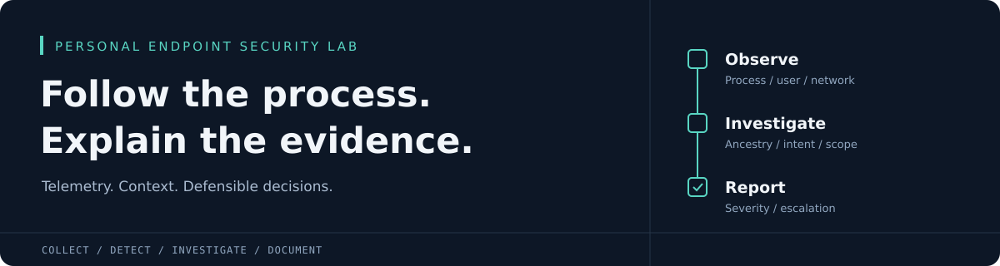
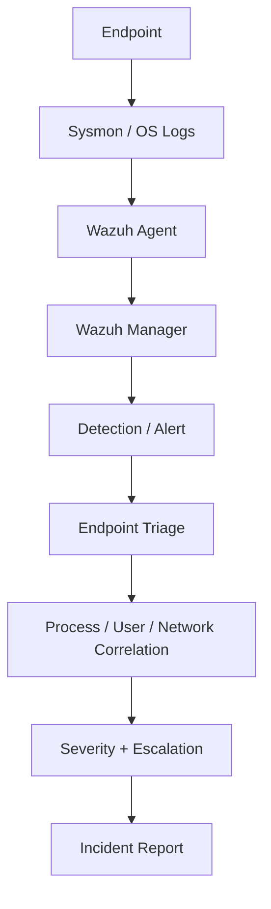

<p align="center">
  
</p>

<h1 align="center">EDR / Endpoint Detection &amp; Investigation Lab</h1>

<p align="center">
  <a href="reports/final-endpoint-report.md"></a>
  <a href="compose.yaml"></a>
  <a href="setup/wazuh-setup.md"></a>
  <a href="reports/validation-matrix.md"></a>
</p>

<p align="center">
  <a href="setup/README.md">Set up the lab</a> &middot;
  <a href="docs/endpoint-triage-playbook.md">Triage playbook</a> &middot;
  <a href="reports/validation-matrix.md">Validation matrix</a> &middot;
  <a href="docs/interview-notes.md">Interview notes</a>
</p>

<p align="center"><sub>Static repository badges; validation status links to the recorded evidence.</sub></p>

A personal endpoint-security portfolio project built around Wazuh, safe activity simulations, and evidence-based SOC triage. It shows how to move from an endpoint event to a defensible investigation: process ancestry, command-line analysis, user context, correlation, legitimate explanations, severity and escalation.

> **Lab only.** No production SOC experience or real company incident is claimed. The Linux loopback path has real telemetry and matching Wazuh alerts. Native Windows scenarios remain **NOT VERIFIED** until executed in a Windows VM. See the [validation matrix](reports/validation-matrix.md) for precise scope.

## Why this project

An alert identifies behavior; it does not establish intent. Encoded PowerShell can be administrator automation, a Run key can belong to an approved application, and repeated connections can be health checks. This lab makes those distinctions explicit and ties conclusions to preserved evidence.

Skills demonstrated include telemetry pipeline validation, candidate detection development, process/user/network correlation, evidence handling, false-positive analysis, severity assessment, escalation reasoning and reproducible documentation. Wazuh, Docker Compose, Fedora and Python support the executed path; Windows PowerShell, Sysmon and Windows Event Logs support the supplied VM workflow.

## Quick start on Fedora/Linux

Install prerequisites using [setup](setup/README.md). From this repository root:

```bash
cp .env.example .env
mkdir -p .runtime/telemetry
touch .runtime/telemetry/network.jsonl
docker compose up -d --wait --wait-timeout 90
python3 scripts/simulate_network_activity.py
python3 scripts/capture_network_validation.py
```

The simulation opens only 127.0.0.1:18080, makes six connections and exits. The verifier requires matching real alerts for the exact run. Originals stay under ignored `evidence/private/`; publication extracts are explicitly redacted. A new capture updates the public latest-run files, so preserve the original report's evidence and update [incident 004](investigations/incident-004.md) when publishing a new run.

Root Compose runs the **manager engine without a dashboard**. Follow [Wazuh setup](setup/wazuh-setup.md) for the optional official manager/indexer/dashboard stack, generated credentials, enrollment, log verification and troubleshooting. Do not run both deployments on the same ports.

The optional full stack was also started and verified: indexer/dashboard health and manager API authentication passed, and Filebeat connected successfully. [Infrastructure result](evidence/validation/full-stack.json). Services were stopped after validation to free memory; start the path you need using the documented commands.

## Endpoint telemetry flow



This is the intended Windows path. The executed Linux fallback uses helper JSON and the manager's localfile collector. [Architecture and trust boundaries](architecture/architecture.md) explain both paths and their limitations.

## Scenarios

1. [Suspicious PowerShell](scenarios/01-suspicious-powershell/README.md): encoded harmless text plus whoami child process; investigate payload, parent, user, hash and behavior. Candidate rule 100100.
2. [Persistence](scenarios/02-persistence/README.md): removable current-user Run value pointing to a harmless marker command. Candidate rule 100110; distinguish artifact creation from later execution.
3. [Account creation](scenarios/03-privileged-account-change/README.md): create a disabled local standard account, inspect actor/target and potential privilege impact, then remove it. Candidate rule 100120. This scenario does not add administrator membership.
4. [Controlled network activity](scenarios/04-suspicious-outbound-connection/README.md): repeated loopback TCP connections, process context and frequency analysis. Windows candidate rule 100130; verified Linux helper rule 100140.

After [agent](setup/endpoint-agent-setup.md) and [Sysmon](setup/sysmon-setup.md) setup, run in Windows PowerShell 5.1 from `C:\EDR` (elevated for account creation/export):

```powershell
.\scripts\simulate_powershell_activity.ps1 -LabConfirmed
.\scripts\simulate_persistence.ps1 -LabConfirmed
.\scripts\simulate_account_change.ps1 -LabConfirmed
.\scripts\simulate_network_activity.ps1 -LabConfirmed
.\scripts\export_windows_evidence.ps1 -Minutes 15
# After evidence capture:
.\scripts\simulate_persistence.ps1 -LabConfirmed -Cleanup
.\scripts\simulate_account_change.ps1 -LabConfirmed -Cleanup
```

Run one scenario at a time and verify its events before continuing. The scripts reject collisions with existing lab-named artifacts. No script downloads or executes malware or contacts an external test target.

## Investigation and response workflow

Use the [18-question endpoint triage playbook](docs/endpoint-triage-playbook.md). Preserve originals, identify host/user/process, reconstruct ancestry, inspect command lines and privilege, correlate nearby events, evaluate authorization and scope, assign LOW/MEDIUM/HIGH/CRITICAL, and explain escalation and remediation. Wazuh numeric levels do not determine final severity automatically.

- [Detection methodology and field contracts](docs/detection-methodology.md)
- [PowerShell investigation worksheet](investigations/incident-001.md)
- [Persistence investigation worksheet](investigations/incident-002.md)
- [Account investigation worksheet](investigations/incident-003.md)
- [Executed Linux network investigation](investigations/incident-004.md)
- [Reusable incident report](reports/incident-report-template.md)
- [Final endpoint report](reports/final-endpoint-report.md)

The first three records are prepared worksheets with evidence-dependent fields marked NOT VERIFIED. They must not be presented as completed investigations.

## Verification

```bash
python3 scripts/check_repository.py
docker compose config --quiet
docker compose exec -T manager /var/ossec/bin/wazuh-analysisd -t
python3 scripts/test_rules.py
docker compose exec -T manager /var/ossec/bin/agent_control -l
docker compose exec -T manager tail -n 20 /var/ossec/logs/alerts/alerts.json
```

Rule tests use explicitly synthetic JSON in a separate Wazuh container with a test-only decoder bridge. They exercise predicates and hierarchy, and do not prove Windows EventChannel transport. Actual Windows fields must still be inspected and rules adjusted if necessary before marking those scenarios complete.

The [five-minute checklist](docs/five-minute-verification.md) covers quick operational checks. [Validation evidence](evidence/README.md) explains provenance, original hashes and redactions.

## Findings and limitations

The retained Linux run produced six actual connection records and six matching Wazuh alerts. It was classified LOW, benign authorized activity, with no escalation. The finding is bounded to helper-observed loopback activity; it is not a detection-rate metric or evidence of enterprise protection.

Windows VM execution, real Sysmon/Windows Security collection, agent ingestion and native scenario dashboard presentation require manual verification. The lab has no malware execution, independent kernel process attribution in the fallback, enterprise baseline, memory acquisition, automated isolation, tamper-resistance validation or fleet-scale evaluation. Per-connection rules do not automatically detect beaconing frequency.

Future improvements: complete native evidence runs, add controlled private-VM network traffic if loopback is invisible, test authorized versus unauthorized group changes, collect richer process context, build a measured baseline, and expand persistence coverage only after validating actual fields.

## Screenshots and career preparation

Follow the [manual screenshot checklist](screenshots/README.md). No fake screenshots are included. Read [EDR concepts](docs/edr-concepts.md), [interview notes](docs/interview-notes.md), and [honest resume bullets](docs/resume-bullets.md).

## References and ATT&CK

- [Wazuh Docker deployment](https://documentation.wazuh.com/current/deployment-options/docker/wazuh-container.html) and [Windows log collection](https://documentation.wazuh.com/current/user-manual/capabilities/log-data-collection/configuration.html)
- [Microsoft Sysmon](https://learn.microsoft.com/en-us/sysinternals/downloads/sysmon) and [Security event 4720](https://learn.microsoft.com/en-us/previous-versions/windows/it-pro/windows-10/security/threat-protection/auditing/event-4720)
- [T1059.001 PowerShell](https://attack.mitre.org/techniques/T1059/001/), [T1547.001 Run keys](https://attack.mitre.org/techniques/T1547/001/), [T1136.001 Local account creation](https://attack.mitre.org/techniques/T1136/001/)

ATT&CK describes simulated mechanisms, not proof of adversary intent. No C2/exfiltration mapping is forced onto the loopback exercise. No project license has been declared; upstream Wazuh and Microsoft components retain their own licenses.
