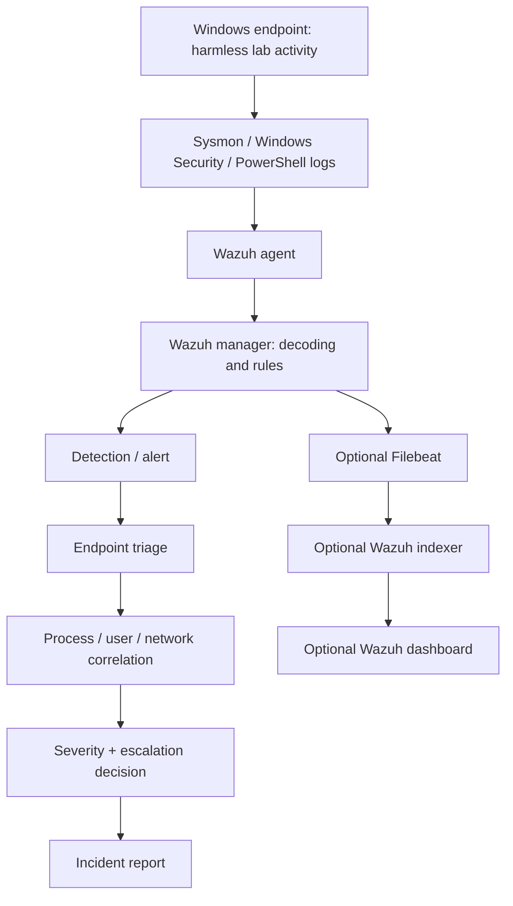

# Architecture and trust boundaries

## Intended Windows investigation path



The endpoint and manager communicate over the private lab network. TCP 1515 enrolls the agent; TCP 1514 carries agent telemetry. Default host bindings are loopback until explicitly changed to a host-only adapter. The optional dashboard publishes 8443 only on localhost; indexer/API management ports also stay local. No active-response command or automatic isolation is configured.

## Executed Linux fallback

```text
Python child → real TCP loopback listener → JSONL observer records
                                            ↓ read-only bind mount
                                     Wazuh localfile collector
                                            ↓
                                  JSON decoder → rule 100140
                                            ↓
                                  alerts.json → evidence verifier
                                            ↓
                                    incident-004.md
```

The helper runs on Fedora, and manager-local collection uses agent ID 000. The observer knows which child it launched, but independently proving socket ownership requires kernel telemetry. This limitation is part of the investigation.

## Storage and validation

- Root Compose: persistent named volumes for manager configuration/enrollment, logs and queues. Source config/rules are copied on startup.
- `.runtime/`: ignored runtime inputs and optional upstream full stack, including generated credentials/certificates.
- `evidence/private/`: original telemetry and raw alert exports; ignored by Git.
- `evidence/validation/`: reviewed redacted actual network evidence and separately labeled synthetic rule-test results.
- `compose.test.yaml`: disposable, network-disabled rule-test manager with its own container filesystem. Its Windows-to-JSON bridge never changes the live manager.

There is no cloud service, external attack target, enterprise domain, production data source, malware payload or custom frontend. A Windows VM is required to close the native endpoint validation gap. The full-stack dashboard is a presentation/analysis option; source-event and alert evidence remain the core deliverables.
